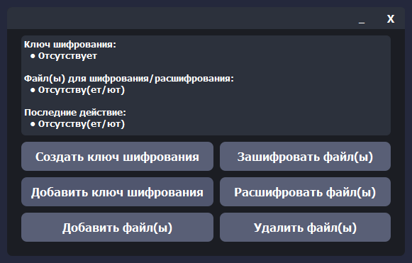

# Cryptographer
Cryptographer - программа для шифрование/расшифрования файлов с помощью ключа шифрования.

# Возможности
- Создавать/Добавлять ключ шифрования.
- Шифровать/Расшифровывать файлы добавленные в программу.

# Установка и использование
1. Устанавливаем Python 3.9.
2. Устанавливаем зависимости и настраиваем проект:
```sh
git clone https://github.com/EXG1O/Cryptographer.git
cd VK-Bot
pip3 install -r requirements.txt
```
3. Запускаем проект через команду:
```sh
cd Cryptographer
python main.py (Для Linux: python3 main.py)
```
5. Наслаждаемся шифровальщиком! :D

# Демонстрация ПО
## Главное окно:
